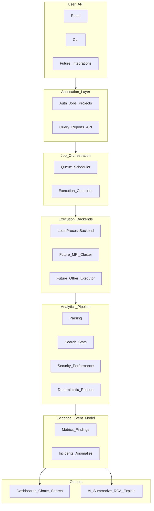
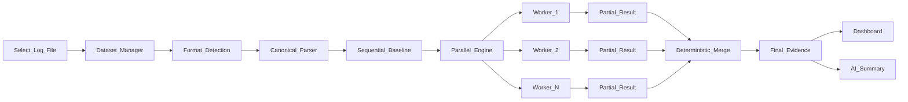
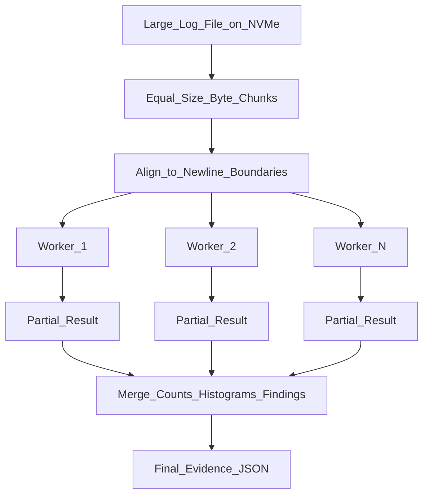
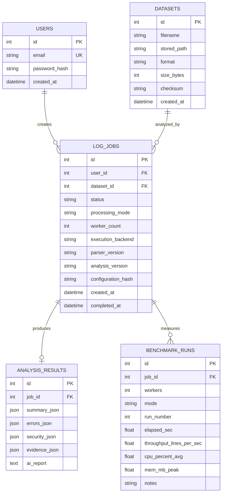

# AI-Powered Parallel Log Intelligence Platform

## Implementation Guide (7-Day Manual) — Version 2.0

**Project:** AI-Powered Parallel Log Intelligence Platform  
**Course focus:** Parallel Programming / High-Performance Computing  
**Hardware profile (your laptop):** 12th Gen Intel Core i5-1235U · 10 cores / 12 logical processors · 12 GB DDR4-3200 · Intel Iris Xe (no CUDA) · NVMe SSD · Virtualization Enabled  
**Constraint:** Free / educational tools only — no credit card required  
**This document:** Planning and execution manual only. Do not treat this file as source code.  
**Version note:** 2.0 supersedes 1.0. It freezes Stage 1 on four future-proof abstractions while keeping the honest-benchmark, HPC-first spine.

---

# Table of Contents

1. [How to Use This Guide](#1-how-to-use-this-guide)
2. [Project Vision & Stage Boundaries](#2-project-vision--stage-boundaries)
3. [Executive 7-Day Roadmap](#3-executive-7-day-roadmap)
4. [Locked Tech Stack (CV-Optimized, Free)](#4-locked-tech-stack-cv-optimized-free)
5. [Architecture — Computation Engine vs Product Layer](#5-architecture--computation-engine-vs-product-layer)
6. [Core Abstractions & Contracts](#6-core-abstractions--contracts)
7. [Recommended Repository Layout](#7-recommended-repository-layout)
8. [Environment Setup (Exact Versions)](#8-environment-setup-exact-versions)
9. [Large-Scale Logs, InputSource & Formats](#9-large-scale-logs-inputsource--formats)
10. [Where to Get or Generate Log Files](#10-where-to-get-or-generate-log-files)
11. [Database Design & Reproducibility Schema](#11-database-design--reproducibility-schema)
12. [FastAPI, Job Runner & ExecutionBackend](#12-fastapi-job-runner--executionbackend)
13. [GitHub Professional Workflow](#13-github-professional-workflow)
14. [Documentation Checklist](#14-documentation-checklist)
15. [Manual Work vs AI-Generated Work](#15-manual-work-vs-ai-generated-work)
16. [Day-by-Day Execution Manual](#16-day-by-day-execution-manual)
17. [Performance Evaluation Protocol](#17-performance-evaluation-protocol)
18. [Security & Evidence Heuristics](#18-security--evidence-heuristics)
19. [CV & Portfolio Packaging](#19-cv--portfolio-packaging)
20. [Risks, Non-Negotiable Pillars, Cut Scope & Definition of Done](#20-risks-non-negotiable-pillars-cut-scope--definition-of-done)
21. [Quick Reference Cheat Sheet](#21-quick-reference-cheat-sheet)
22. [Final Strategy Note](#22-final-strategy-note)

---

# 1. How to Use This Guide

1. Read Sections 2–6 once to freeze vision, stack, architecture, and the four abstractions.
2. Complete Section 8 (environment) before writing any code.
3. Create the GitHub repo and Project board (Section 13) on Day 1.
4. Follow Section 16 day-by-day; do not skip the **Manual** items in Section 15.
5. Fill `docs/PERFORMANCE.md` with **your** measured numbers only.
6. Use Section 19 to turn the finished repo into resume / LinkedIn material.

**Non-goals of this document:** installing software for you, generating application code, creating the GitHub repository, or running benchmarks.

**Central philosophy:** Protect the HPC spine. Make every benchmark honest. Build Stage 1 so Stage 6 remains architecturally possible — do not build Stage 6 now.

---

# 2. Project Vision & Stage Boundaries

## 2.1 What You Are Building Now (Stage 1)

A CPU-based, high-performance log processing and analytics platform that can:

- Ingest large offline log files
- Parse multiple log formats into a **canonical event model**
- Divide large workloads into independent chunks
- Process chunks concurrently across CPU cores
- Search and filter logs; calculate statistics
- Detect software errors and security-related patterns
- Analyze application and system performance signals
- Aggregate results deterministically via a **partial-result / evidence contract**
- Benchmark sequential and parallel execution
- Visualize analytics and performance
- Generate AI-assisted explanations from **processed evidence only**

The **HPC processing layer is the primary computational engine**. AI is an interpretation and decision-support layer.

## 2.2 Long-Term Vision (Do Not Build This Week)

Not: “A website where users upload log files.”

Yes: **A modular Log Intelligence Engine** that can accept data from files, directories, or real-time streams; process large workloads through local or distributed computation; detect operational and security events; maintain structured analytical evidence; and use AI to help humans investigate incidents.

```text
Stage 1  Local Offline HPC Prototype          ← YOU BUILD THIS (≈20–25% of vision)
Stage 2  Performance-Optimized Local Platform
Stage 3  Distributed HPC Platform
Stage 4  Continuous / Real-Time Log Processing
Stage 5  Production Observability Platform
Stage 6  AI-Assisted Incident Intelligence
```

**Rule:** Freeze Stage 1 architecture so Stages 2–6 are upgrades, not rewrites.

## 2.3 Three Clear Boundaries

```text
BOUNDARY 1 — HPC ENGINE
  Input → Decompose → Parallel Compute → Aggregate → Evidence

BOUNDARY 2 — APPLICATION PLATFORM
  Auth → Datasets → Jobs → Results → API → Dashboard

BOUNDARY 3 — INTELLIGENCE
  Evidence → AI Explanation → RCA Assistance → Recommendations
```

Stage 1 proves: *large workload → decompose → multi-core execute → correct aggregate → measure scalability → expose via a real software system.*

---

# 3. Executive 7-Day Roadmap

| Day   | Theme                        | Definition of Done                                                                                          |
| ----- | ---------------------------- | ----------------------------------------------------------------------------------------------------------- |
| **1** | Foundation                   | WSL2 + toolchain; GitHub repo + Project + Issues; sample logs on `E:`; four abstractions frozen in docs      |
| **2** | Sequential Baseline          | Canonical event model + one parser + sequential stats/errors; verified sequential results                   |
| **3** | Parallel HPC Core            | Byte chunker, newline align, workers, partial-result contract, reducer; **seq ≡ parallel**                  |
| **4** | Benchmark + Analytics        | Worker matrix CLI; speedup/efficiency/throughput; security heuristics; first PERFORMANCE.md draft           |
| **5** | Backend + Database           | FastAPI + SQLite + JWT; datasets/jobs; `LocalProcessBackend` orchestrates HPC; results persisted            |
| **6** | Frontend + AI                | Four React views; aggregate-only Ollama report; upload → analyze → findings → AI explanation                |
| **7** | Evidence + Release           | Full benchmark matrix; strong/weak scaling notes; docs; demo; `v1.0.0` tag; resume bullets                  |

**Daily time budget (recommended):** 6–10 focused hours. Prefer deep work on Days 2–4 and 7 (HPC evidence is what faculty and employers care about most).

---

# 4. Locked Tech Stack (CV-Optimized, Free)

Chosen for: multinational CV signal, course HPC fit, 7-day feasibility, **no credit card**, and your hardware.

| Layer       | Choice                                                  | Version target                  | Why                                                      |
| ----------- | ------------------------------------------------------- | ------------------------------- | -------------------------------------------------------- |
| Host OS     | Windows 11                                              | Your current build              | Already installed                                        |
| Dev OS      | **WSL2 + Ubuntu**                                       | **24.04 LTS**                   | Industry-standard Linux path for HPC/dev                 |
| Language    | **Python**                                              | **3.12.x**                      | Fast full-stack delivery; strong `multiprocessing` story |
| HPC engine  | `multiprocessing` / `ProcessPoolExecutor` + chunked I/O | stdlib                          | Uses 10C/12T; no GPU required                            |
| API         | **FastAPI** + **Uvicorn**                               | FastAPI ≥ 0.115, Uvicorn ≥ 0.32 | Modern backend employers recognize                       |
| ORM         | **SQLAlchemy 2.x** + Alembic mindset                    | 2.0.x                           | Portable schema (SQLite now → PostgreSQL later)          |
| DB          | **SQLite**                                              | bundled                         | Fits 12 GB RAM; still “engineered” if schema is clean    |
| Frontend    | **React 18 + TypeScript + Vite**                        | Node **20 LTS**, Vite 6.x       | Standard enterprise FE stack                             |
| Charts      | **Recharts**                                            | latest stable                   | Simple, CV-visible dashboards                            |
| Auth        | JWT (local)                                             | `python-jose` / `PyJWT`         | Clean full-stack demo                                    |
| AI          | **Ollama** (local)                                      | latest stable                   | Free, offline, no API key / CC                           |
| LLM weights | `llama3.2:3b` or `phi3:mini`                            | pull via Ollama                 | Fits ~12 GB RAM; Iris Xe cannot run CUDA stacks          |
| VCS / CI    | **GitHub Free**                                         | Issues, Projects, PRs, Actions  | Professional workflow signal                             |
| Docs        | Markdown in `docs/` + README                            | —                               | Portfolio-grade presentation                             |
| Containers  | **Skip for Days 1–7**                                   | —                               | RAM too tight; list as Phase-2                           |

### Explicitly rejected (for this 7-day window)

| Tool                                       | Why not now                                  |
| ------------------------------------------ | -------------------------------------------- |
| CUDA / PyTorch GPU                         | Iris Xe = integrated; no NVIDIA discrete GPU |
| Docker Desktop full stack                  | Competing with Cursor/Chrome for 12 GB RAM   |
| AWS / GCP / Azure paid tiers               | Credit card required                         |
| Elasticsearch / OpenSearch / Spark / Kafka | Too heavy for 7 days + 12 GB RAM             |
| Cloud LLM APIs that need billing           | Many require card even for “free” trials     |
| MPI cluster / Kubernetes / multi-tenancy   | Future stages only                           |

### Free / educational accounts you *may* create (no card)

- GitHub (student pack optional if you have `.edu` — useful but not required)
- Hugging Face (optional later; not required if Ollama works)
- Loghub / academic dataset downloads (public GitHub)

---

# 5. Architecture — Computation Engine vs Product Layer

The project splits into **two fundamentally different systems**. Academic benchmarks must measure System A, not the web UI.

## 5.1 System A — Computation Engine (HPC Core)

```text
Input → Ingestion → Workload Decomposition → Scheduling
  → Parallel Processing → Local Aggregation → Global Reduction
  → Structured Analytical Evidence
```

This layer must be **independent** from React, FastAPI, SQLite, JWT, and Ollama. It must run from the CLI:

```bash
python -m hpc_engine.analyze \
    --input datasets/sample.log \
    --workers 4 \
    --mode parallel
```

Use `ProcessPoolExecutor` for CPU-heavy parsing. Submitted/returned objects must be picklable.

## 5.2 System B — Product Layer

```text
React → FastAPI → Job Management → ExecutionBackend → HPC Engine
  → Results → Dashboard → AI Explanation
```

The product layer **orchestrates** the HPC engine. It must not contain the core HPC algorithm. That separation lets you later replace `LocalProcessPool` with MPI or distributed workers without rewriting the frontend.

## 5.3 Future-Proof Layered Architecture



**Evidence / Event Model** is the bridge between HPC computation and AI intelligence.

## 5.4 End-to-End Stage 1 Data Flow



**Critical design rule:** The LLM must **never** receive raw multi-GB logs. Feed it only aggregated evidence JSON (counts, top errors, findings, suspicious IPs, latency percentiles).

## 5.5 Workload Decomposition (HPC Core)



**Correctness rules:**

1. Split by **byte ranges**, then advance each chunk start to the next newline (except chunk 0).
2. Each worker returns **associative partials** only — mergeable without re-reading the file.
3. Sequential (`workers=1`) and parallel (`workers=N`) must produce **identical** aggregates.
4. Prefer **processes** over threads for CPU-bound parsing (Python GIL).

Example (1 GB, 4 workers): `W1: 0–256 MB`, `W2: 256–512 MB`, `W3: 512–768 MB`, `W4: 768 MB–1 GB`. For every chunk except the first: `seek(start)` then `readline()` to discard the incomplete first line. Process until the logical end boundary, finishing the current line. Result: no duplicate lines, no missing lines, no partial-line corruption.

## 5.6 Scheduling Strategy

| Level | Strategy | Stage 1 status |
| ----- | -------- | -------------- |
| 1 | Static: N equal byte chunks → N workers | **Mandatory baseline** |
| 2 | Dynamic: many smaller chunks → task queue → workers pull next | **Stretch goal** |

## 5.7 Load Balancing on i5-1235U

Your CPU is **hybrid** (P-cores + E-cores) with **12 logical processors**.

| Worker count | Intent                                                     |
| ------------ | ---------------------------------------------------------- |
| 1            | Sequential baseline                                        |
| 2, 4         | Mild parallelism                                           |
| 6, 8         | Strong scaling sweet-spot candidates                       |
| 12           | Saturate logical processors (may show diminishing returns) |

## 5.8 Component Responsibilities

| Module              | Responsibility                                           | Layer       |
| ------------------- | -------------------------------------------------------- | ----------- |
| `execution/`        | `ExecutionBackend` abstraction; `LocalProcessBackend`    | Application |
| `datasets/`         | Register, validate, metadata, checksum                   | Application |
| `hpc/chunking/`     | Byte-range split + newline align                         | HPC         |
| `hpc/scheduling/`   | Static (required); dynamic (stretch)                     | HPC         |
| `hpc/parsers/`      | Format-specific → Canonical LogEvent                     | HPC         |
| `hpc/engines/`      | Search, stats, security, performance                     | HPC         |
| `hpc/aggregation/`  | Partial results + deterministic reducer                  | HPC         |
| `evidence/`         | Findings / severity / evidence payloads                  | HPC → AI    |
| `benchmarks/`       | Timing, speedup, efficiency                              | App + HPC   |
| `ai/`               | Ollama with aggregate-only prompts                       | AI          |
| `api/`              | FastAPI routes                                           | Application |
| `web` (frontend)    | Four React views                                         | Presentation|

---

# 6. Core Abstractions & Contracts

Freeze these four abstractions on Day 1. They allow local HPC to evolve into distributed / streaming systems without a rewrite.

## 6.1 Abstraction Summary

| Abstraction | Stage 1 minimum |
| ----------- | --------------- |
| **Canonical Log Event** | `timestamp`, `level`, `service`, `message` |
| **Analysis Job** | dataset + mode + workers + backend + versions + status lifecycle |
| **Partial Result / Evidence Contract** | Small mergeable JSON; never full record dumps |
| **Execution Backend** | `LocalProcessBackend` via `backend.execute(job_spec)` |

Also introduce **InputSource** as an interface with Stage 1 implementation `FileInputSource` only (Directory / Stream / Network / MessageQueue are future).

## 6.2 Canonical Log Event

Different formats convert into one internal representation. Stage 1 start fields:

```text
timestamp, level, service, message
```

Add later as needed: `source`, IP, status, endpoint, latency, `raw_reference` (offset/length).

Example shape (full future form — implement only fields you need):

```json
{
  "event_id": "evt-123456",
  "timestamp": "2026-08-04T12:30:22.456Z",
  "source_type": "nginx",
  "source_file": "access.log",
  "host": "server-01",
  "service": "booking-api",
  "environment": "production",
  "level": "ERROR",
  "message": "Database connection timeout",
  "ip_address": "192.0.2.100",
  "http_method": "POST",
  "http_path": "/api/bookings",
  "status_code": 500,
  "response_time_ms": 3210,
  "raw_reference": { "offset": 10485760, "length": 250 }
}
```

## 6.3 Parser Registry

Do not create one giant parser.

```text
ParserRegistry
  ├── ApacheParser
  ├── NginxParser
  ├── ApplicationParser
  └── JsonlParser
```

Flow: `File → Format Detection → ParserRegistry → Specific Parser → Canonical LogEvent`.

**MVP formats:** Generic Application Log, JSONL, Apache/Nginx. Everything else is extension work.

## 6.4 Worker Output Contract (Partial Result)

Workers must **not** return all parsed log records. Return small, structured, mergeable, deterministic partials:

```json
{
  "worker_id": 2,
  "records_processed": 2500000,
  "valid_records": 2499900,
  "invalid_records": 100,
  "level_counts": {
    "INFO": 1800000,
    "WARNING": 400000,
    "ERROR": 280000,
    "CRITICAL": 19900
  },
  "status_counts": { "200": 1900000, "404": 300000, "500": 250000 },
  "error_patterns": {
    "database_timeout": 12000,
    "authentication_failure": 8500
  },
  "service_counts": {
    "auth-service": 500000,
    "booking-service": 1000000,
    "payment-service": 999900
  }
}
```

Associative partials: counts, sums, min/max, histograms, finding counters. Today: `Worker → Parent`. Future: `Worker Node → Aggregator Node` with the **same contract**.

## 6.5 Evidence Model

Processing produces structured evidence for humans and AI — not vague text.

```json
{
  "finding_id": "finding-001",
  "type": "AUTHENTICATION_FAILURE_SPIKE",
  "severity": "HIGH",
  "confidence": 0.91,
  "timestamp_start": "...",
  "timestamp_end": "...",
  "affected_service": "auth-service",
  "source_ips": ["192.0.2.10", "192.0.2.11"],
  "event_count": 12800,
  "evidence": {
    "failed_login_count": 12800,
    "unique_users": 420,
    "window_seconds": 300
  }
}
```

AI receives **Structured Evidence**, never raw logs.

## 6.6 ExecutionBackend

```python
# Conceptual contract — application calls this, not multiprocessing.Pool everywhere
backend.execute(job_spec)
```

Stage 1 implement: `LocalProcessBackend`.  
Future stubs (document / empty module OK): `MPIBackend`, `DistributedBackend`, `StreamingBackend`.

## 6.7 Sequential / Parallel Parity

Same analysis logic. Only difference: `workers = 1` vs `workers = N`. Verify identity for:

```text
Total / valid / invalid records
Error / warning counts
Service counts, status codes
Security findings, statistics
```

This is non-negotiable.

---

# 7. Recommended Repository Layout

```text
parallel-log-intelligence/
├── README.md
├── LICENSE
├── pyproject.toml             # or requirements.txt
├── .gitignore
├── .github/
│   ├── ISSUE_TEMPLATE/
│   │   ├── bug_report.md
│   │   └── feature_request.md
│   ├── PULL_REQUEST_TEMPLATE.md
│   └── workflows/
│       └── ci.yml
├── docs/
│   ├── architecture/
│   │   ├── system.md
│   │   ├── hpc-engine.md
│   │   ├── data-flow.md
│   │   └── future-roadmap.md
│   ├── PERFORMANCE.md         # YOU fill with real numbers
│   ├── SETUP.md
│   ├── DATASETS.md
│   ├── SECURITY.md
│   └── DEMO_SCRIPT.md
├── data/
│   ├── samples/               # small committed samples (<2 MB)
│   └── .gitkeep
├── backend/
│   ├── app/
│   │   ├── main.py
│   │   ├── api/
│   │   ├── auth/
│   │   ├── jobs/
│   │   ├── datasets/
│   │   ├── execution/
│   │   │   ├── base.py
│   │   │   ├── local_process.py
│   │   │   └── future_backends.py
│   │   ├── hpc/
│   │   │   ├── chunking/
│   │   │   ├── scheduling/
│   │   │   ├── workers/
│   │   │   ├── parsers/
│   │   │   ├── engines/
│   │   │   └── aggregation/
│   │   ├── evidence/
│   │   ├── security/
│   │   ├── ai/
│   │   ├── benchmarks/
│   │   ├── db/
│   │   └── core/
│   ├── tests/
│   └── scripts/
│       ├── generate_synthetic_logs.py
│       └── run_benchmarks.py
├── frontend/
│   ├── package.json
│   ├── index.html
│   └── src/
│       ├── pages/
│       ├── components/
│       ├── features/
│       ├── api/
│       └── charts/
├── datasets/                  # or point config at E:\datasets\log-intelligence\
│   ├── samples/
│   └── generated/
└── benchmarks/
    ├── configs/
    ├── raw/
    ├── processed/
    └── results/
```

**Critical improvement:** `execution/` separates *what* to run from *how* it runs.

**Store large datasets on `E:\`** (e.g. `E:\datasets\log-intelligence\`) and point config at that path. Keep `C:` free for Windows/WSL.

---

# 8. Environment Setup (Exact Versions)

All steps below are **manual**. Prefer installing heavy tools inside **WSL2**, not only Windows, so paths and multiprocessing behave like Linux servers.

## 8.1 Hardware Hygiene (read before installing)

| Resource | Your machine             | Rule                                                                         |
| -------- | ------------------------ | ---------------------------------------------------------------------------- |
| RAM      | 12 GB (often ~70% used)  | Close Chrome tabs; quit unused Electron apps during benchmarks               |
| CPU      | i5-1235U @ base 1.30 GHz | Plug in AC power; set Windows power mode to Best Performance for timing runs |
| GPU      | Iris Xe (shared memory)  | Do **not** plan CUDA; Ollama will use CPU                                    |
| Disk     | NVMe; C: tight, E: freer | Project + datasets → `E:`                                                    |
| Virt     | Enabled                  | Required for WSL2                                                            |

**WSL2 memory cap (recommended):** create/edit `%UserProfile%\.wslconfig`:

```ini
[wsl2]
memory=6GB
processors=8
swap=4GB
```

Then in PowerShell: `wsl --shutdown` and reopen Ubuntu.

## 8.2 Install WSL2 + Ubuntu 24.04

In **PowerShell (Admin)**:

```powershell
wsl --install -d Ubuntu-24.04
```

If WSL already exists:

```powershell
wsl -l -v
wsl --set-default Ubuntu-24.04
```

Inside Ubuntu:

```bash
sudo apt update && sudo apt upgrade -y
sudo apt install -y build-essential git curl wget unzip ca-certificates
```

## 8.3 Git + GitHub CLI

```bash
git --version
sudo apt install -y gh
gh auth login    # HTTPS, login via browser — free
```

```bash
git config --global user.name "Your Name"
git config --global user.email "your@email.com"
```

## 8.4 Python 3.12 (WSL)

```bash
sudo apt install -y python3.12 python3.12-venv python3-pip
python3.12 --version   # expect 3.12.x
```

```bash
cd /mnt/e/Galib/IUB/IUB-Semester\ 9/Parallel\ Programming/Project
python3.12 -m venv .venv
source .venv/bin/activate
pip install --upgrade pip
```

**Core packages (Day 2+):**

```text
fastapi
uvicorn[standard]
sqlalchemy
pydantic
python-multipart
httpx
pytest
ruff
```

Pin exact versions in `requirements.txt` after first successful install.

## 8.5 Node.js 20 LTS (for React)

```bash
curl -o- https://raw.githubusercontent.com/nvm-sh/nvm/v0.40.1/install.sh | bash
# restart shell
nvm install 20
node -v    # v20.x
npm -v
```

## 8.6 Ollama (local AI, free, no card)

On **Windows** or WSL — pick one host and stick to it:

1. Download from [https://ollama.com](https://ollama.com) (free).
2. Pull a small model:

```bash
ollama pull llama3.2:3b
# fallback if RAM pressure:
ollama pull phi3:mini
```

3. Test:

```bash
ollama run llama3.2:3b "Summarize: 1200 ERROR lines, top IP 203.0.113.5 with 400 failed logins."
```

If the machine swaps heavily, use `phi3:mini` only and keep prompts tiny.

## 8.7 Optional: GitHub Student Developer Pack

[https://education.github.com/pack](https://education.github.com/pack) — **not required**.

## 8.8 Verification Checklist

Before Day 2 coding:

- [ ] `wsl -l -v` shows Ubuntu 24.04, VERSION 2
- [ ] `python3.12 --version`
- [ ] `node -v` → 20.x
- [ ] `gh auth status` OK
- [ ] `ollama list` shows a small model
- [ ] Project folder reachable from WSL under `/mnt/e/...`
- [ ] At least 15–20 GB free on `E:` for datasets + venv + node_modules

---

# 9. Large-Scale Logs, InputSource & Formats

## 9.1 InputSource Abstraction

Internal design is **not** coupled to “uploaded files only.”

```text
InputSource
  ├── FileInputSource          ← Stage 1
  ├── DirectoryInputSource     ← future
  ├── ArchiveInputSource       ← future
  ├── StreamInputSource        ← future
  ├── NetworkInputSource       ← future
  └── MessageQueueInputSource  ← future
```

Processing engine receives:

```text
Input Source → Canonical Event Stream → Processing Engine
```

The engine must not care where data came from.

## 9.2 Never Load the Whole File

| Bad                             | Good                            |
| ------------------------------- | ------------------------------- |
| `content = open(path).read()`   | Stream by line or mmap chunks   |
| Hold all parsed dicts in a list | Emit counters / histograms only |
| Send raw log to LLM             | Send evidence / aggregate JSON  |
| Copy multi-GB files to `C:`     | Keep on `E:` NVMe partition     |

## 9.3 Chunked Parallel Read Strategy

1. `os.path.getsize(path)` → total bytes `T`.
2. Choose `N` workers → nominal chunk size `T / N`.
3. For worker `i`, start = `i * chunk`, end = `(i+1) * chunk` (last gets remainder).
4. If `start > 0`, seek to `start` and `readline()` once to discard partial line.
5. Parse until file position ≥ `end` (and finish current line).
6. Return partial result dict (Section 6.4).
7. Parent merges via deterministic reducer.

**Chunk size guidance:**

| File size     | Suggested workers              | Notes                          |
| ------------- | ------------------------------ | ------------------------------ |
| ≤ 10 MB       | 1–4                            | Overhead may dominate          |
| 100 MB        | 4–8                            | Good demo size                 |
| 500 MB – 1 GB | 6–12                           | Close other apps; watch RAM    |
| > 2 GB        | 8–12 + smaller in-memory state | Prefer streaming counters only |

## 9.4 Memory Budget (practical)

| Process             | Soft budget           |
| ------------------- | --------------------- |
| WSL + Python parent | ≤ 1.0 GB              |
| Each worker         | ≤ 300–500 MB peak     |
| Ollama (idle/light) | ≤ 2–3 GB for 3B model |
| Vite/React dev      | ≤ 1 GB                |
| Browser dashboard   | ≤ 1 GB                |

**Rule:** During official benchmarks, stop frontend + Ollama; run CLI benchmark script only.

## 9.5 I/O vs CPU Bound

Logs on NVMe are fast; parsing regex can still be CPU-bound — good for parallel speedup. If speedup is poor:

- Confirm **processes**, not threads.
- Check antivirus isn’t scanning every read.
- Ensure workers aren’t contending on one lock.
- Try larger files (10 MB often shows *no* speedup).

## 9.6 Supported Formats (MVP vs Stretch)

**MVP (must ship):**

- Apache Common / Combined access log
- Nginx access log
- Generic application log (`TIMESTAMP LEVEL message`)
- JSON Lines (`.jsonl`)

**Stretch if time:**

- Linux syslog
- CSV logs
- Windows Event Log exported as text/CSV

---

# 10. Where to Get or Generate Log Files

All sources below are free / public. Prefer academic and open datasets.

## 10.1 Public Datasets (download)

| Source                     | What you get                               | Link / search term                                                   |
| -------------------------- | ------------------------------------------ | -------------------------------------------------------------------- |
| **Loghub** (LogPAI)        | Many real system logs (HDFS, Apache, etc.) | [https://github.com/logpai/loghub](https://github.com/logpai/loghub) |
| **Loghub-2.0**             | Larger collections                         | Search GitHub `logpai/loghub2`                                       |
| Classic **NASA HTTP** logs | Public web access logs                     | Search “NASA HTTP logs Kennedy”                                      |
| **SecRepo** sample logs    | Security-oriented samples                  | [https://www.secrepo.com/](https://www.secrepo.com/)                 |
| Sample Nginx/Apache        | Small teaching sets                        | Search “sample nginx access.log github”                              |

**Manual steps:**

1. Download ZIP/tarball to `E:\datasets\log-intelligence\raw\`.
2. Document license + citation in `docs/DATASETS.md`.
3. Copy a **small** sanitized sample into `data/samples/` for CI (< 2 MB).

## 10.2 Generate Synthetic Logs (recommended for scaling tests)

| File              | Approx size | Purpose                     |
| ----------------- | ----------- | --------------------------- |
| `synth_10mb.log`  | 10 MB       | Correctness + microbench    |
| `synth_100mb.log` | 100 MB      | Main demo                   |
| `synth_500mb.log` | 500 MB      | Scaling                     |
| `synth_1gb.log`   | 1 GB        | Stretch / impressive figure |

Synthetic generator should mix INFO/WARN/ERROR/CRITICAL, fake IPs/users/endpoints, occasional “Failed password”, “SQL syntax”, “401/403/500”, and timestamps spanning hours/days.

**You must manually verify** a random sample looks realistic and parsers accept it.

## 10.3 Capture Real Local Logs (high authenticity)

```bash
sudo journalctl -u ssh --no-pager > /mnt/e/datasets/log-intelligence/local_ssh.txt
```

Windows optional: Event Viewer → Save as CSV/TXT (stretch).

## 10.4 Dataset Hygiene

- Do not commit secrets, real emails, or production credentials.
- Sanitize IPs if required by faculty ethics rules.
- Record: source, size, line count, format, checksum (`sha256sum`) in DATASETS.md.

---

# 11. Database Design & Reproducibility Schema

Use **SQLite** for the 7-day build. Design tables so a later move to PostgreSQL is mostly a connection-string change.

## 11.1 What to Store

| Store | Do not store |
| ----- | ------------ |
| Users, Datasets, Jobs, Analysis Results, Benchmark Runs, AI Reports | Raw multi-GB log content |
| Paths, metadata, aggregates, findings | Every parsed line |

Dataset metadata (example): `dataset_id`, `filename`, `path`, `size`, `format`, `checksum`, `created_at`.

## 11.2 Logical Schema



**Why the extra job fields?** Later you must answer: *“How was this result produced?”* — reproducibility.

## 11.3 Status Values

`LOG_JOBS.status`: `queued` → `running` → `aggregating` → `completed` | `failed`

`LOG_JOBS.processing_mode`: `sequential` | `parallel`

`LOG_JOBS.execution_backend` (Stage 1): `local_process`

## 11.4 Management Practices

1. Keep DB file under `backend/data/app.db` (gitignored).
2. Provide a `scripts/reset_db.py` for demos.
3. Never store raw multi-GB log **content** in SQLite.
4. Export benchmark table to `benchmarks/results/*.csv` for the report.
5. Backup before Day 7 demo: copy `app.db` to `E:\backups\`.

## 11.5 Future Data Architecture (document only)

| Stage | Storage |
| ----- | ------- |
| 1 | SQLite + local filesystem |
| 2 | PostgreSQL + local object storage |
| 3 | PostgreSQL + object storage + search index |
| 4 | Event stream + object storage + analytics layer + metadata DB |

Raw logs remain immutable artifacts when possible. DB stores metadata, results, findings, jobs, indexes, references.

---

# 12. FastAPI, Job Runner & ExecutionBackend

## 12.1 Recommended Endpoints

```text
POST   /api/auth/register
POST   /api/auth/login

POST   /api/datasets
GET    /api/datasets
GET    /api/datasets/{id}

POST   /api/jobs
GET    /api/jobs/{id}
POST   /api/jobs/{id}/cancel

GET    /api/jobs/{id}/results

POST   /api/jobs/{id}/ai-summary

POST   /api/benchmarks
GET    /api/benchmarks/{id}

GET    /api/system/capabilities
```

Job create response:

```json
{ "job_id": "job-001", "status": "queued" }
```

Client polls: `queued → running → aggregating → completed` (or `failed`).

## 12.2 Stage 1 Job Runner

```text
FastAPI → Job Service → LocalProcessBackend → ProcessPoolExecutor → HPC Engine
```

Do **not** permanently tie heavy HPC work to FastAPI `BackgroundTasks` as the long-term design. For the 7-day prototype, a local job runner started by FastAPI is acceptable. Evolution path:

```text
Stage 1: FastAPI → Local Job Runner
Stage 2: FastAPI → Durable Local Job Queue
Stage 3: FastAPI → Distributed Job Scheduler
Stage 4: FastAPI → Cluster / Stream Processing
```

## 12.3 Frontend Views (exactly four)

1. **Dashboard** — total datasets/jobs, recent analysis, system performance teaser  
2. **New Analysis** — select file, format, workers, analysis profile, Run  
3. **Analysis Result** — totals, errors/warnings/critical, top services/errors, security findings, performance indicators  
4. **Benchmark** — execution time, speedup, efficiency, throughput vs workers  

Recommended charts: Workers vs Execution Time / Speedup / Efficiency / Throughput.

## 12.4 AI Layer Contract

```text
Evidence + Analytics + Metrics + Findings → AI → Explanation
```

Not: `Raw Logs → AI → Trust Everything`.

AI should answer: What happened? Why might it have happened? How serious? What evidence? What to investigate next?

---

# 13. GitHub Professional Workflow

This section is high CV impact. Recruiters and hiring managers often open GitHub before reading the whole report.

## 13.1 Create the Repository (Day 1, manual)

```bash
gh repo create parallel-log-intelligence --public --source=. --remote=origin --push
```

Suggested description:

> CPU-parallel log analytics platform with FastAPI, React, and local LLM summaries. HPC benchmarks: speedup, efficiency, strong scaling.

Topics: `hpc`, `parallel-computing`, `fastapi`, `react`, `log-analysis`, `multiprocessing`, `benchmarking`

## 13.2 Branch Strategy

| Branch                    | Purpose            |
| ------------------------- | ------------------ |
| `main`                    | Always demoable    |
| `feat/<issue>-short-name` | Features           |
| `fix/<issue>-short-name`  | Fixes              |
| `docs/<topic>`            | Documentation-only |

Protect `main`: require PR (even if only you).

## 13.3 Labels (create once)

| Label             | Color idea | Use                  |
| ----------------- | ---------- | -------------------- |
| `type:hpc`        | blue       | Parallel engine work |
| `type:backend`    | green      | FastAPI/DB           |
| `type:frontend`   | purple     | React                |
| `type:ai`         | teal       | Ollama               |
| `type:docs`       | gray       | Documentation        |
| `type:benchmark`  | orange     | Perf experiments     |
| `priority:P0`     | red        | Blocks demo          |
| `priority:P1`     | yellow     | Should have          |
| `priority:P2`     | white      | Nice to have         |
| `good first task` | pink       | Small slices         |

## 13.4 GitHub Project Board

**Columns:** `Backlog` → `Ready` → `In Progress` → `In Review` → `Done`

**Seed issues on Day 1 (examples):**

1. Canonical LogEvent model + ParserRegistry skeleton  
2. FileInputSource + Dataset manager metadata  
3. Sequential baseline processor  
4. Byte chunker + newline alignment  
5. ProcessPool parallel runner + LocalProcessBackend  
6. Partial-result contract + deterministic reducer  
7. Sequential/parallel parity tests  
8. Stats / error detection engine  
9. Security heuristic → Evidence findings  
10. Benchmark harness CLI (worker matrix)  
11. FastAPI datasets + jobs + results  
12. SQLite models with reproducibility fields  
13. JWT auth  
14. React four views + Recharts  
15. Ollama aggregate-only summary  
16. GitHub Actions CI  
17. PERFORMANCE.md experiment matrix  
18. Architecture docs under `docs/architecture/`  
19. Demo script + screenshots  

Link each issue to the Project. Move cards daily — **manual project management**.

## 13.5 Issue Template / PR Rules

**Bug:** environment, steps, expected vs actual, logs  
**Feature:** user story, acceptance criteria, HPC impact (yes/no)

Even as a solo developer:

1. One issue ↔ one PR when possible.
2. PR title: `feat(hpc): parallel chunk parser (#12)`
3. PR body: Summary, Test plan, Benchmark note (if HPC), Screenshots (if UI).
4. Squash merge; delete branch after merge.

## 13.6 GitHub Actions (free minutes)

- On PR to `main`: `ruff` lint, `pytest` on small samples, `npm ci && npm run build`
- Do **not** run 1 GB benchmarks in CI
- Badge in README

## 13.7 Commit Message Style

```text
feat(hpc): add ProcessPoolExecutor runner
fix(parser): align chunk boundaries to newlines
docs(perf): add strong scaling table for 100MB dataset
test(agg): assert sequential and parallel parity
```

---

# 14. Documentation Checklist

Ship these files by Day 7:

| File | Owner | Notes |
| ---- | ----- | ----- |
| `README.md` | You + AI draft | Problem, features, quickstart, architecture image, benchmark highlight, stack |
| `docs/architecture/system.md` | You | System A/B split, four abstractions |
| `docs/architecture/hpc-engine.md` | You | Chunking, scheduling, partial contract |
| `docs/architecture/data-flow.md` | You | Mermaid end-to-end |
| `docs/architecture/future-roadmap.md` | You | Stages 2–6 only — no build claims |
| `docs/SETUP.md` | You | WSL, versions, `.wslconfig`, Ollama |
| `docs/DATASETS.md` | **You (manual)** | Sources, sizes, checksums, citations |
| `docs/PERFORMANCE.md` | **You (manual)** | Tables from your laptop only |
| `docs/SECURITY.md` | You | Auth, upload validation, resource limits |
| `docs/DEMO_SCRIPT.md` | You | 3–5 minute walkthrough |
| `LICENSE` | You | MIT is fine for portfolio |

README teaser (replace with your numbers):

> On a 12th Gen i5-1235U (12 logical processors), parallel processing of a 100 MB synthetic log achieved **X.Xx speedup** at N=8 workers with **Y% parallel efficiency**.

---

# 15. Manual Work vs AI-Generated Work

Use this as a hard policy for authenticity, grading integrity, and CV honesty.

## 15.1 Must Be Done By Hand (AI cannot replace)

| Task | Why it must be you |
| ---- | ------------------ |
| Install WSL, pin versions, fix path/`CRLF` issues | Environment reality on *your* machine |
| Download/generate datasets; verify line samples | Data integrity |
| Design chunk size / worker matrix for benchmarks | Experimental design |
| Run sequential vs parallel jobs; record wall times | Real evidence |
| Capture CPU% / RAM from Task Manager or `htop` | Hardware-grounded results |
| Confirm seq aggregates ≡ parallel aggregates | Scientific correctness |
| Interpret speedup/efficiency/anomalies (E-cores, turbo, I/O) | HPC understanding faculty expect |
| Write PERFORMANCE.md conclusions | Your analysis voice |
| Curate Issues + Project board priorities daily | Real engineering process |
| Write PR descriptions from **actual** diffs | Proof of ownership |
| Take UI screenshots; record demo narration | Portfolio authenticity |
| Map results to course outcomes | Academic alignment |
| Final presentation / viva answers | Cannot outsource comprehension |
| Resume bullets with honest metrics | Ethics |

## 15.2 AI May Generate (you must review line-by-line)

| Artifact | AI OK? | Your duty |
| -------- | ------ | --------- |
| Repo folder scaffolding | Yes | Ensure layout matches Section 7 |
| FastAPI route stubs | Yes | Test every endpoint |
| SQLAlchemy models | Yes | Validate schema vs Section 11 |
| React components / Recharts | Yes | Fix UX; verify API wiring |
| Regex parsers | Yes | Validate on real samples |
| Chunker + ProcessPool skeleton | Yes | **You** prove correctness |
| ExecutionBackend stubs | Yes | Keep HPC callable from CLI alone |
| Pytest cases | Yes | Add edge cases AI missed |
| Ollama prompt templates | Yes | Keep prompts evidence/aggregate-only |
| GitHub Actions YAML | Yes | Confirm green on GitHub |
| Issue/PR templates | Yes | Customize labels |
| README first draft | Yes | Rewrite claims to match real benches |
| Synthetic log generator | Yes | **You** run and inspect output |
| Mermaid diagrams | Yes | Ensure they match implementation |

## 15.3 Never Do

- Fabricate benchmark numbers.
- Commit API keys (none needed if Ollama-local).
- Paste entire AI chat as “documentation.”
- Claim distributed cluster / GPU acceleration you did not build.
- Upload proprietary/company logs without permission.

---

# 16. Day-by-Day Execution Manual

## Day 1 — Foundation

**Goals:** Environment, repo, board, data, architecture freeze (including four abstractions).

**Manual checklist:**

- [ ] Complete Section 8 verification list
- [ ] `gh repo create` + push initial README
- [ ] Create labels + Project board + seed 15+ issues
- [ ] Download Loghub sample **or** generate 10 MB + 100 MB synthetic logs on `E:`
- [ ] Write `docs/architecture/system.md` (System A/B, four abstractions)
- [ ] Write `docs/architecture/future-roadmap.md` (Stages 2–6 — roadmap only)
- [ ] Write `docs/DATASETS.md` with real file sizes

**AI allowed:** README skeleton, issue text drafts, `.gitignore`, Mermaid cleanup.

**DoD:** Repository exists; architecture frozen; sample dataset available; clone-fresh setup instructions exist.

---

## Day 2 — Sequential Baseline

**Goals:** Canonical event model + one parser + sequential processor + stats/errors.

**Manual checklist:**

- [ ] Define Canonical LogEvent (minimum fields)
- [ ] Implement one parser path via ParserRegistry (e.g. application log or JSONL)
- [ ] Sequential processor produces level counts, error patterns
- [ ] Spot-check results against a known small file by hand
- [ ] Open PR linked to issue

**AI allowed:** model stubs, pytest boilerplate.

**DoD:** Sequential engine produces verified results on `synth_10mb.log`.

---

## Day 3 — Parallel HPC Core

**Goals:** Chunker, workers, partial-result contract, reducer, parity.

**Manual checklist:**

- [ ] Byte chunker + newline alignment
- [ ] Worker processes return Section 6.4 partials only
- [ ] Deterministic reducer merges partials
- [ ] Parallel runner with selectable `workers`
- [ ] Test: same file → identical totals for workers=1..N
- [ ] CLI works: `python -m hpc_engine.analyze ...` (or equivalent module path)
- [ ] Open PR `feat(hpc): parallel chunk engine`

**AI allowed:** code stubs, pytest boilerplate.

**DoD:** `pytest` proves **Parallel result == Sequential result**.

---

## Day 4 — Benchmark + Analytics

**Goals:** Worker matrix, first real timings, security heuristics → evidence.

**Manual checklist:**

- [ ] Top N endpoints / status codes / IPs / services
- [ ] Security heuristics emit Evidence findings (Section 18)
- [ ] CLI: `python -m scripts.run_benchmarks --file ... --workers 1,2,4,6,8,12`
- [ ] Fill first draft table in PERFORMANCE.md (raw times)
- [ ] Keep AC power; note CPU clock / hybrid-core behavior
- [ ] Optional stretch: note static scheduling imbalance

**DoD:** First real performance results; at least one chart-worthy speedup on 100 MB.

---

## Day 5 — Backend + Database

**Goals:** FastAPI + SQLite + datasets/jobs + LocalProcessBackend + JWT.

**Manual checklist:**

- [ ] Endpoints from Section 12.1 (auth, datasets, jobs, results, benchmarks)
- [ ] Job service calls `LocalProcessBackend.execute(job_spec)` — not raw Pool in routes
- [ ] Persist aggregates + evidence JSON; store reproducibility fields
- [ ] Manual HTTP test of full flow: upload → job → HPC → result
- [ ] Confirm HPC still runs from CLI without FastAPI

**DoD:** Upload 10 MB via API and fetch JSON summary; HPC engine remains independently executable.

---

## Day 6 — Frontend + AI

**Goals:** Four React views + aggregate-only Ollama.

**Screens:**

1. Dashboard  
2. New Analysis (file, format, workers, profile)  
3. Analysis Result / status  
4. Benchmark charts  

**Manual checklist:**

- [ ] Wire to real API (no mock-only demo)
- [ ] “Generate AI Report” sends **evidence/aggregates only** to Ollama
- [ ] Handle Ollama-down gracefully
- [ ] Screenshot each screen into `docs/images/`
- [ ] CI lint + test + frontend build green (if not already)

**DoD:** User → Upload → Analyze → View findings → Generate AI explanation.

---

## Day 7 — Evidence + Release

**Manual checklist:**

- [ ] Full matrix: files {100MB, 500MB} × workers {1,2,4,6,8,12}
- [ ] Compute speedup \(S_p = T_1 / T_p\), efficiency \(E_p = S_p / p\)
- [ ] Strong scaling table; optional weak scaling note
- [ ] Finish PERFORMANCE.md discussion (bottlenecks, hybrid CPU, I/O vs CPU)
- [ ] Correctness re-verification (parity)
- [ ] DEMO_SCRIPT.md dry-run (≤ 5 minutes)
- [ ] Tag release `v1.0.0`
- [ ] Write resume bullets (Section 19)
- [ ] Backup repo + `app.db` + datasets list

**DoD:** Reproducible academic HPC system; faculty can clone, follow SETUP, run small demo; PERFORMANCE.md has honest i5-1235U numbers.

---

# 17. Performance Evaluation Protocol

## 17.1 Metrics

| Metric | Formula / method |
| ------ | ---------------- |
| Execution time | Wall-clock seconds |
| Speedup | \(S_p = T_1 / T_p\) |
| Efficiency | \(E_p = S_p / p\) |
| Throughput | lines/sec or MB/sec |
| CPU utilization | Task Manager / `htop` average during run |
| Memory | Peak RSS of worker tree |
| Strong scaling | Fixed data size, increase \(p\) |
| Weak scaling | Grow data roughly proportional to \(p\) |

## 17.2 Experimental Rules (manual discipline)

1. Warm-up run discarded (filesystem cache).
2. Repeat each point **3 times**; report mean (± note variance / min / max).
3. Same file path, same parser, same analysis, same machine, same power plan, same software version.
4. No Cursor agent / browser heavy load during timed runs.
5. Record: date, WSL memory cap, model/app versions (`parser_version`, `analysis_version`).
6. Do not fabricate numbers.

## 17.3 Experiment Matrix

### Required — Experiment A: Worker Count

Workers: `1, 2, 4, 6, 8, 12`. Measure: execution time, speedup, efficiency, throughput, CPU utilization, memory usage.

### Required — Strong Scaling

Fixed dataset (e.g. 1 GB or 100–500 MB if RAM-limited). Same worker matrix. Question: how much faster does the same problem become with more CPU resources?

### Required — I/O vs CPU note (Experiment F lite)

At least one qualitative/quantitative note comparing read-only vs parse-only vs parse+analyze to classify CPU-bound / I/O-bound / memory-bound behavior.

### Stretch — Experiment B: Static vs Dynamic Scheduling

Measure worker idle time, load imbalance, total runtime, scheduling overhead.

### Stretch — Experiment C: Chunk Granularity

Compare `4 workers / 4 tasks` vs `4 / 16` vs `4 / 64`. Question: how does granularity affect load balancing vs scheduling overhead?

### Stretch — Experiment D: Parser Optimization

Baseline vs optimized parser; parsing throughput and overall time.

### Stretch — Experiment E: Aggregation Strategies

Immediate global updates vs local aggregation + final reduction. Expected lesson: less synchronization generally scales better.

### Stretch — Weak Scaling

Example: 1 worker → 100 MB; 2 → 200 MB; 4 → 400 MB; 8 → 800 MB. Question: can performance stay similar as workload and resources grow together?

## 17.4 Results Table Template (copy into PERFORMANCE.md)

| Dataset | Size | Workers | Run1 s | Run2 s | Run3 s | Mean s | Speedup | Efficiency | Notes |
| ------- | ---- | ------- | ------ | ------ | ------ | ------ | ------- | ---------- | ----- |
| synth_100mb | 100 MB | 1 | | | | | 1.00 | 1.00 | baseline |
| synth_100mb | 100 MB | 2 | | | | | | | |
| synth_100mb | 100 MB | 4 | | | | | | | |
| synth_100mb | 100 MB | 8 | | | | | | | |
| synth_100mb | 100 MB | 12 | | | | | | | |

## 17.5 What “Good” Looks Like on This Laptop

Expect **sublinear** speedup. Efficiency dropping after 6–8 workers is normal on hybrid U-series CPUs. Explaining *why* is stronger than claiming perfect linear scaling.

---

# 18. Security & Evidence Heuristics

Even as a local academic project, design basic security correctly.

## 18.1 Application Security

| Area | Rule |
| ---- | ---- |
| Authentication | JWT |
| Passwords | Hash only — never plaintext |
| Upload validation | Extension, MIME, size, allowed format, filename safety |
| Path safety | Use Dataset ID internally — never trust client paths |
| Resource limits | Max file size, simultaneous jobs, worker count, AI prompt size |

## 18.2 Stage 1 Detection (deterministic heuristics)

| Pattern | Signal |
| ------- | ------ |
| Authentication burst | > X failures from same IP within Y minutes |
| HTTP error spike | 5xx rate > baseline |
| Suspicious access | Many endpoints from one IP in short window |
| Scanning | Many 404s across many paths |
| Sensitive paths | `/admin`, `/.env`, `/config` |

Produce: Finding, Severity, Evidence, Timestamp, Source, Count.

Avoid: “This is definitely an attack.”  
Prefer: “Potential brute-force activity detected.”

---

# 19. CV & Portfolio Packaging

## 19.1 Resume Bullets (customize with your metrics)

- Built a **CPU-parallel log intelligence platform** (Python multiprocessing, FastAPI, React/TypeScript) processing multi-hundred-MB logs on a 12-core logical workstation.
- Designed **workload decomposition** with newline-aligned chunking, an associative **partial-result / evidence contract**, and verified **sequential/parallel parity**.
- Separated a CLI-runnable **HPC engine** from the product layer via an **ExecutionBackend** abstraction (`LocalProcessBackend`).
- Measured **speedup/efficiency/strong scaling** across worker counts 1–12; documented reproducible benchmarks and bottlenecks.
- Integrated **local LLM (Ollama)** for evidence/aggregate-only incident summaries — no GPU/cloud dependency.
- Delivered professional SDLC artifacts: GitHub Issues/Projects, PR workflow, and CI via GitHub Actions.

## 19.2 LinkedIn / GitHub About Blurb

> Parallel Log Intelligence Platform — HPC-style offline log analytics with process-level parallelism, benchmarking (speedup/efficiency), FastAPI + React UI, and local LLM explanations. Built for multi-core CPUs without CUDA.

## 19.3 Keywords for ATS

`High Performance Computing`, `Parallel Computing`, `Multiprocessing`, `Workload Decomposition`, `Performance Benchmarking`, `FastAPI`, `React`, `TypeScript`, `SQLAlchemy`, `Log Analysis`, `Security Analytics`, `GitHub Actions`, `WSL2`

## 19.4 Interview Talking Points (prepare by hand)

1. Why processes over threads for parsing in Python  
2. How newline alignment prevents split-line corruption  
3. Why the partial-result contract enables future distributed reduction  
4. Why efficiency falls on hybrid P/E cores  
5. Why the LLM must not see raw logs  
6. How `ExecutionBackend` lets you swap local ProcessPool for MPI later — as future work only  

---

# 20. Risks, Non-Negotiable Pillars, Cut Scope & Definition of Done

## 20.1 Five Non-Negotiable Pillars

| Pillar | Meaning |
| ------ | ------- |
| **1. Correctness** | Sequential == Parallel |
| **2. Performance** | Measurable speedup |
| **3. Scalability** | Strong scaling (+ weak scaling note if possible) |
| **4. Evidence** | Real benchmark data |
| **5. Modularity** | HPC engine independent from web application |

Everything else is secondary.

## 20.2 If Behind Schedule — Cut in This Order

| Keep (non-negotiable) | Cut / defer |
| --------------------- | ----------- |
| Parallel vs sequential + parity test | Windows Event Log format |
| Benchmarks + PERFORMANCE.md | Dynamic work-stealing scheduler |
| One solid parser family (Apache/JSONL) | Fancy auth/roles / multi-tenancy |
| Minimal API + minimal UI (four views) | Beautiful design system / multiple dashboards |
| Ollama **or** high-quality templated report | Both AI features + recommendation engine |
| GitHub README + CI | Kafka, Elasticsearch, K8s, MPI cluster, cloud deploy |
| ExecutionBackend + partial-result contract | Streaming / Directory / Network InputSources |

## 20.3 What You Should NOT Build in 7 Days

```text
Kafka, Elasticsearch, Kubernetes, multi-node MPI cluster,
microservice explosion, complex RBAC, multi-tenancy,
advanced ML / deep-learning anomaly detection,
real-time streaming, mobile app, cloud deployment
```

These are future stages.

## 20.4 Project-Level Definition of Done

The project is done when **all** are true:

1. Public GitHub repo with clear README and architecture docs  
2. Parallel engine with measurable speedup on ≥ 100 MB data  
3. Correctness: sequential ≡ parallel aggregates  
4. HPC engine runnable from CLI without the web stack  
5. FastAPI + React path for upload → results  
6. At least one AI **or** high-quality templated explanation from evidence/aggregates  
7. PERFORMANCE.md with real i5-1235U numbers  
8. CI green on `main`  
9. Demo script executable in ≤ 5 minutes  

## 20.5 Phase-2+ (Post-Submission / Portfolio Upgrade)

- Dynamic scheduling, task granularity, parser optimization, I/O profiling  
- Docker Compose when you have more RAM  
- PostgreSQL  
- MPI or multi-node experiments on university lab machines  
- Continuous ingestion / streaming  
- Production observability concerns (HA, roles, retention, encryption, alerting)  
- AI incident correlation assistant (Stage 6)  

---

# 21. Quick Reference Cheat Sheet

| Item | Value |
| ---- | ----- |
| Primary OS for dev | WSL2 Ubuntu 24.04 |
| Python | 3.12.x + venv |
| Node | 20 LTS |
| DB | SQLite (SQLAlchemy 2) |
| HPC API | ProcessPoolExecutor + chunking |
| Execution | `LocalProcessBackend` |
| Four abstractions | Canonical Event, Analysis Job, Partial/Evidence, ExecutionBackend |
| AI | Ollama `llama3.2:3b` / `phi3:mini` (aggregates only) |
| Benchmark workers | 1, 2, 4, 6, 8, 12 |
| Dataset drive | `E:\datasets\log-intelligence\` |
| WSL RAM cap | 6GB (+ 4GB swap) suggested |
| CI | GitHub Actions free |
| Cost | $0 / no credit card |
| Stage 1 scope | ≈20–25% of long-term vision |

---

# 22. Final Strategy Note

Your proposal frames this as a **complete modular HPC software system**, not a toy algorithm. In seven days, protect the spine:

```text
decomposition → parallel execution → correct aggregation → measured speedup
  → clear documentation → professional GitHub process
```

Freeze Stage 1 on four abstractions from Day 1: **Canonical Log Event**, **Analysis Job**, **Partial Result / Evidence Contract**, and **Execution Backend**. Those contracts are what let a local academic prototype evolve into a larger real-world platform without rewriting everything.

AI can accelerate typing. **Only you** can produce trustworthy benchmarks, honest analysis, and a repository that a multinational hiring panel trusts.

```text
TODAY: Local CPU Parallel Engine
  → Performance Optimization
  → Distributed HPC
  → Real-Time Processing
  → Incident Intelligence
  → AI-Assisted Operations Platform
```

---

*Guide version: 2.0 · Supersedes 1.0 · Matched to hardware: Intel i5-1235U, 12 GB DDR4, Iris Xe, NVMe · Free-tier toolchain only · Incorporates future-ready architecture while freezing Stage 1 scope.*
