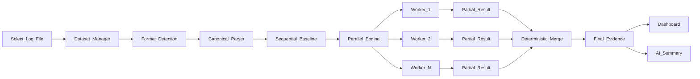

# Stage 1 Data Flow



## InputSource

```text
InputSource
  ├── FileInputSource          ← Stage 1
  ├── DirectoryInputSource     ← future
  ├── ArchiveInputSource       ← future
  ├── StreamInputSource        ← future
  ├── NetworkInputSource       ← future
  └── MessageQueueInputSource  ← future
```

Engine contract:

```text
Input Source → Canonical Event Stream → Processing Engine
```

## AI contract

The LLM must **never** receive raw multi-GB logs.

```text
Evidence + Analytics + Metrics + Findings → AI → Explanation
```

## Job lifecycle

```text
queued → running → aggregating → completed | failed
```

## Storage

- Raw logs: local filesystem (`E:\datasets\log-intelligence\`), immutable artifact.
- SQLite: users, dataset metadata, jobs, aggregates, evidence, benchmark runs, AI reports.
- Never store multi-GB log **content** in SQLite.
