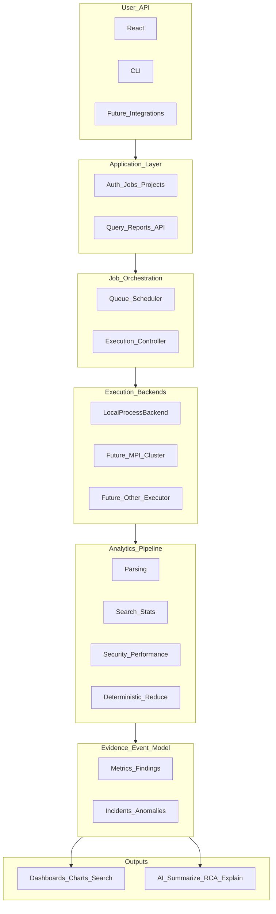

# System Architecture (Stage 1 Freeze)

**Status:** Frozen on Day 1. Do not break these boundaries during Days 2–7.

## Two systems

### System A — Computation Engine (HPC core)

```text
Input → Ingestion → Workload Decomposition → Scheduling
  → Parallel Processing → Local Aggregation → Global Reduction
  → Structured Analytical Evidence
```

- Independent of React, FastAPI, SQLite, JWT, and Ollama.
- Must run from the CLI:

```bash
python -m hpc_engine.analyze --input datasets/sample.log --workers 4 --mode parallel
```

- Uses `ProcessPoolExecutor`. Submitted/returned objects must be picklable.

### System B — Product Layer

```text
React → FastAPI → Job Management → ExecutionBackend → HPC Engine
  → Results → Dashboard → AI Explanation
```

Orchestrates System A. Does **not** contain the core HPC algorithm.

## Four frozen abstractions

| Abstraction | Stage 1 minimum |
| ----------- | --------------- |
| **Canonical Log Event** | `timestamp`, `level`, `service`, `message` |
| **Analysis Job** | dataset + mode + workers + backend + versions + status lifecycle |
| **Partial Result / Evidence Contract** | Small mergeable JSON; never full record dumps |
| **Execution Backend** | `LocalProcessBackend` via `backend.execute(job_spec)` |

**InputSource:** Stage 1 implements `FileInputSource` only. Directory / Stream / Network / MessageQueue are future.

## Layered flow



Evidence / Event Model is the bridge between HPC computation and AI.

## Three boundaries

```text
BOUNDARY 1 — HPC ENGINE
  Input → Decompose → Parallel Compute → Aggregate → Evidence

BOUNDARY 2 — APPLICATION PLATFORM
  Auth → Datasets → Jobs → Results → API → Dashboard

BOUNDARY 3 — INTELLIGENCE
  Evidence → AI Explanation → RCA Assistance → Recommendations
```

## Stage 1 scope

Build ≈20–25% of the long-term vision: prove that a large workload can be decomposed, executed across CPU cores, aggregated correctly, measured, and exposed through a real software system.

See also: [hpc-engine.md](hpc-engine.md), [data-flow.md](data-flow.md), [future-roadmap.md](future-roadmap.md).
